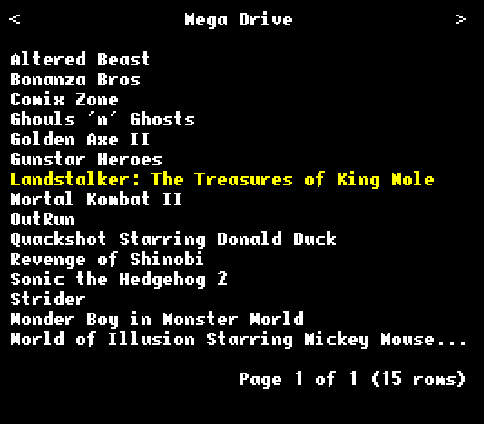
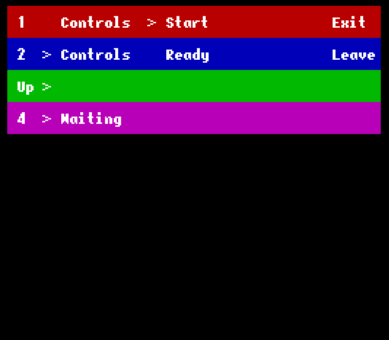

ROM Launcher
============

Simple ROM launcher for RetroArch that provide the following features:

 -  [x] Retro 8-bit style
 -  [x] Lightweight (< 2MB)
 -  [x] Highly configurable (configure the command line per emulator)
 -  [x] Plug & play, support any joystick (generics & Xbox 360)
 -  [x] Easy and intuitive UI (only one button + arrows/sticks)
 -  [x] Allows multiple controllers to be configured at the same time by
    different players (up to 10 players)
 -  [x] Save controller configuration per console **and per game**: play with
    the bindings you want on a specific game
 -  [x] Ideal for retro-gaming installation without keyboard





Installation
------------

You need Rust (stable), then you can compile with:

```
git clone git@github.com:cecton/rom_launcher.git
cd rom_launcher
cargo build --release
strip target/release/rom_launcher  # Optional: to reduce the binary size
```

The binary will be located in `target/release/rom_launcher`.

Usage
-----

 -  Run it
 -  Press Q to exit the program
 -  A new configuration file 'state.json' will be generated.

    **Make sure the program is stopped before editing the configuration file
    otherwise it will be overwritten upon exit.**

    You can edit it to add your emulators and controller templates. The mapping
    is done using RetroArch's configuration so it should look like:

    ```
    ["a", "A"]
    ["left", "Left"]
    ```
    (where "a"/"left" is the actual key in RetroArch and "A"/Left" a label in
    ROM Launcher.  Use the existing configurations as sample)
 -  You can't control the UI without a joystick (for now)
 -  Restart the program
 -  Every time you run a game, the program will wait in background for the
    emulator to quit and then it will restart. (To actually quit the program you
    need to press Q.)
